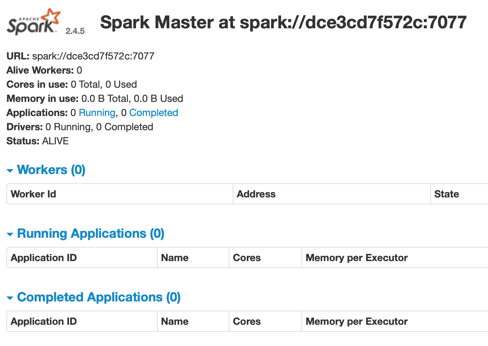
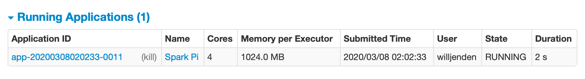

# Spark in Docker


### Spark Cluster

It's possible to run Spark in a container. Using the [bitnami/spark](https://hub.docker.com/r/bitnami/spark) hosted on DockerHub is a simple starting point. As spark is a distributed system, we'll need to set up a master node and a few workers and a network to conect them.

```bash
docker network create --driver bridge spark-network
docker run --name spark-master \
	-p 8080:8080 \
	-p 7077:7077 \
	--network spark-network \
	-d bitnami/spark:2.4.5
```

You'll see some output in the terminal confirming that the service is starting. The last few lines tell you where to find the Spark UI and the location of the spark master node.

```
20/03/06 20:28:47 INFO Utils: Successfully started service 'sparkMaster' on port 7077.
20/03/06 20:28:47 INFO Master: Starting Spark master at spark://dce3cd7f572c:7077
20/03/06 20:28:47 INFO Master: Running Spark version 2.4.5
20/03/06 20:28:48 INFO Utils: Successfully started service 'MasterUI' on port 8080.
20/03/06 20:28:48 INFO MasterWebUI: Bound MasterWebUI to 0.0.0.0, and started at http://dce3cd7f572c:8080
```

Note that these ports are on the container. You can choose to map them to the host as needed. In the example above they're mapped directly.

If you navigate to localhost:8080 you should see a UI like this.



Note that at this point there are no workers. We'll need to start (at least) one separately. The command is very similar except we need to pass a few variable to tell the container to run as a worker and where to find the master. We also no longer need to expose ports to the host as we will not access the worker directly.

```bash
docker run --name spark-worker-1 \
	--network spark-network \
	-e SPARK_MODE=worker \
	-e SPARK_MASTER_URL=spark://spark-master:7077 \
	-d bitnami/spark:2.4.5
```


> You could also use the [`docker-compose.yml`](docker-compose.yml) (adapted from [this example](https://github.com/bitnami/bitnami-docker-spark/blob/master/docker-compose.yml#L5)) to spin up a cluster with two workers by running `docker-compose up`. Once it's finished running you can go to localhost:8080 and see the UI which should now show two workers. This encapsulation of multiple containers into a service is a powerful abstraction that can turn many steps into one.


### Local Environment for spark-submit

Either way, you have a spark cluster which you need to be able to use. We're going to use `spark-submit` to pass jobs to the cluster. One of these easiest ways to get this capability is to install pyspark which includes spark as a dependency. Start by verifying the versions of scala and python used on your cluster.

```bash
$ docker exec spark-master spark-submit --version
Welcome to
      ____              __
     / __/__  ___ _____/ /__
    _\ \/ _ \/ _ `/ __/  '_/
   /___/ .__/\_,_/_/ /_/\_\   version 2.4.5
      /_/
                        
Using Scala version 2.11.12, OpenJDK 64-Bit Server VM, 1.8.0_242
Branch HEAD
Compiled by user centos on 2020-02-02T19:38:06Z
Revision cee4ecbb16917fa85f02c635925e2687400aa56b
Url https://gitbox.apache.org/repos/asf/spark.git
Type --help for more information.
$ docker exec spark-master python --version
Python 3.6.10
```

And now create a correpsonding python environment with pyspark.

```bash
conda create -n sparkenv python=3.6.10 pyspark==2.4.5
conda activate sparkenv
spark-submit --version
```

If the installation was successful, the last command will print out some info about Spark, includinng the Scala version. This should match what is running on our cluster.

```
Welcome to
      ____              __
     / __/__  ___ _____/ /__
    _\ \/ _ \/ _ `/ __/  '_/
   /___/ .__/\_,_/_/ /_/\_\   version 2.4.5
      /_/
                        
Using Scala version 2.11.12, Java HotSpot(TM) 64-Bit Server VM, 1.8.0_65
```


> It's possible to skip the step of installing spark locally and use spark-submit on the master node of your cluster. This would require a mechanism of sharing or transfer the code to the running container. There are several solutions but this approach of referencing a remote master node is easy.


### Write some Scala

Now let's write something that we can submit to the cluster. We'll create a new scala project called hello-spark. We'll start by creating a directory for the source code and config and use [simple build tool (sbt)](https://www.scala-sbt.org/) and to package the code into a jar. This requires a `build.sbt` file to define the package and dependencies and source code in a `src/main/scala` directory.

```bash
mkdir hello-spark
cd hello-spark
mkdir -p src/main/scala
touch build.sbt
```


Add the following contents into `build.sbt`. This declares that we are creating a package called "Hello Spark" which will use Scala 2.11.12 (the same as our cluster) and then adding Spark and Spark SQL as dependencies. The double percent between "org.apache.spark" and "spark-core" tells sbt to use the libraries built for Scala 2.11.12 as opposed to explicitly stating `"org.apache.spark % "spark-core_2.11"`. This and decalring the `sparkVersion` help keep our code DRY.

```scala
name := "Hello Spark"

version := "1.0.0"

scalaVersion := "2.11.12"

val sparkVersion = "2.4.5"

libraryDependencies ++= Seq(
    "org.apache.spark" %% "spark-core" % sparkVersion,
    "org.apache.spark" %% "spark-sql" % sparkVersion
)
```


We're going to follow the [PiSpark](https://github.com/apache/spark/blob/master/examples/src/main/scala/org/apache/spark/examples/SparkPi.scala) example from Apache which uses an algorithm to approximate the value of Pi. Copy and paste the code into a file at `src/main/scala/PiSpark.scala` . It should look something like this:

```scala
import scala.math.random
import org.apache.spark.sql.SparkSession

object SparkPi {
  def main(args: Array[String]): Unit = {

    val spark = SparkSession
      .builder
      .appName("Spark Pi")
      .getOrCreate()
		
    val slices = if (args.length > 0) args(0).toInt else 2
    val n = math.min(100000L * slices, Int.MaxValue).toInt // avoid overflow
    val count = spark.sparkContext.parallelize(1 until n, slices).map { i =>
      val x = random * 2 - 1
      val y = random * 2 - 1
      if (x*x + y*y <= 1) 1 else 0
    }.reduce(_ + _)
    
    println(s"Pi is roughly ${4.0 * count / (n - 1)}")
    
    spark.stop()
  }
}
```


Return to the terminal in the `hello-spark` directory and run the `sbt` command to create an sbt prompt which we can use to compile and package our code into a jar.

```bash
$ sbt
[info] sbt server started
sbt:Hello Spark> compile
[info] Compiling 1 Scala source to ~/Projects/spark/hello-spark/target/scala-2.11/classes ...
[success] Total time: 9 s, completed Mar. 7, 2020, 5:52:04 p.m.
sbt:Hello Spark> package
[success] Total time: 0 s, completed Mar. 7, 2020, 5:52:33 p.m.
sbt:Hello Spark> exit
[info] shutting down sbt server
```


Now let's check the target directory for the package we just created.

```bash
$ ls target/scala-2.11
classes                    update
hello-spark_2.11-1.0.0.jar updateFull
```


Now that we have packaged our code and have the location of the jar, we're ready to submit to our cluster.


### Submit code to Spark

This is now the easy part. Call `spark-submit` and pass the entry class, the location of the master node, and the path to the jar.

```bash
spark-submit \
	--class SparkPi \
	--master spark://localhost:7077 \
	target/scala-2.11/hello-spark_2.11-1.0.0.jar
```

You may see a lot of output depending on the debug level configured. The key line you're looking for should be something like this:

```
20/03/07 18:04:00 INFO DAGScheduler: Job 0 finished: reduce at SparkPi.scala:22, took 14.012523 s
Pi is roughly 3.1416179141617913
```


If you check the Spark Master UI you should see an entry in Running Applications for the few seconds while the job completes and then you'll see an entry under Complete Applications.




### Useful Links

* DockerHub -- [bitnami/spark](https://hub.docker.com/r/bitnami/spark) image and instructions
* Medium -- [Submitting a Python Script to Apache Spark on Docker](https://medium.com/@thiagolcmelo/submitting-a-python-job-to-apache-spark-on-docker-b2bd19593a06)
* Youtube -- [Deploy jar to cluster](https://www.youtube.com/watch?v=1BeTWT8ADfE)
* SBT -- [sbt by example](https://www.scala-sbt.org/1.x/docs/sbt-by-example.html)

